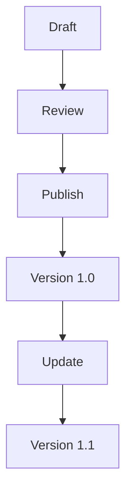

## Overview

Francisco Rubio provides a flexible platform for managing documentation. You organize content into spaces, structure projects efficiently, handle various content types with versioning, and collaborate seamlessly. These core concepts form the foundation for effective documentation management.

<Columns cols={2}>
  <Card title="Documentation Spaces" icon="book-open" href="#documentation-spaces">
    Group related docs into isolated spaces for better organization.
  </Card>
  <Card title="Project Strategies" icon="layers" href="#project-organization">
    Structure your projects with folders, tags, and hierarchies.
  </Card>
  <Card title="Content & Versioning" icon="git-branch" href="#content-versioning">
    Manage pages, MDX files, and track changes over time.
  </Card>
  <Card title="Collaboration" icon="users" href="#collaboration">
    Review, comment, and merge changes with your team.
  </Card>
</Columns>

## Documentation Spaces

Documentation spaces act as containers for your projects. Create a space for each major initiative, such as API docs or user guides. Each space maintains its own permissions, themes, and navigation.

<Callout kind="info">
  Spaces isolate content, preventing cross-contamination while allowing shared components.
</Callout>

Use spaces to scale documentation as your projects grow. For example, separate public user docs from internal developer references.

## Project Organization Strategies

Organize projects within spaces using a consistent structure. Choose strategies based on your team's needs.

<Tabs>
  <Tab title="Folder-Based" icon="folder">
    Use nested folders for hierarchical navigation.

    ```
    docs/
    ├── introduction.mdx
    ├── quickstart/
    │   └── index.mdx
    └── api/
        └── reference.mdx
    ```
  </Tab>
  <Tab title="Tag-Based" icon="tag">
    Apply tags for dynamic filtering and search.

    <CodeGroup tabs="Configuration">
      ```yaml
      # frontmatter example
      ---
      tags: ["core", "api"]
      ---
      ```
      ```javascript
      // Query by tags
      const docs = await fetchDocs({ tags: ["core"] });
      ```
    </CodeGroup>
  </Tab>
  <Tab title="Hybrid" icon="grid">
    Combine folders and tags for flexibility.

    Start with core folders, then tag pages for cross-references.
  </Tab>
</Tabs>

## Content Types and Versioning

Francisco Rubio supports Markdown, MDX, and custom components. Version content to track changes and publish updates.



<Expandable title="Versioning Best Practices" default-open="true">
  Pin versions to branches or tags. Use semantic versioning like `v1.0.0`.

  ```yaml
  # Example frontmatter with version
  ---
  title: API Reference
  version: "1.2.0"
  ---
  ```
</Expandable>

## Collaboration Workflows

Follow these steps to collaborate effectively.

<Steps>
  <Step title="Create Branch" icon="git-branch">
    Fork or branch from the main space.
  </Step>
  <Step title="Draft Changes" icon="edit-3">
    Write and preview MDX content.
  </Step>
  <Step title="Request Review" icon="eye">
    Assign reviewers and add comments.
  </Step>
  <Step title="Merge & Publish" icon="git-merge">
    Resolve feedback and deploy the update.
  </Step>
</Steps>

<Callout kind="tip">
  Enable notifications for reviews to stay responsive. Use `{@mention}` syntax for direct pings.
</Callout>

Master these concepts to build scalable, collaborative documentation in Francisco Rubio.